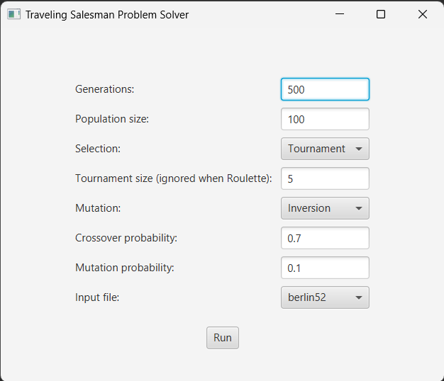

<a name="top"></a>

# TSP Heuristic Solver

<details>
  <summary>Table of Contents</summary>
  <ol>
    <li>
      <a href="#about-the-project">About The Project</a>
      <ul>
        <li><a href="#built-with">Built With</a></li>
      </ul>
    </li>
    <li>
      <a href="#getting-started">Getting Started</a>
      <ul>
        <li><a href="#prerequisites">Prerequisites</a></li>
        <li><a href="#installation">Installation</a></li>
        <li><a href="#run">Run</a></li>
      </ul>
    </li>
    <li>
        <a href="#usage">Usage</a>
        <ul>
            <li><a href="#instructions">Instructions</a></li>
            <li><a href="#rules">Rules</a></li>
            <li><a href="#controls">Controls</a></li>
            <li><a href="#settings">Settings</a></li>
            <li>
                <a href="#game-modes">Game Modes</a>
                <ul>
                    <li><a href="#user-vs-ai">User vs AI</a></li>
                    <li><a href="#user-vs-user">User vs User</a></li>
                    <li><a href="#ai-vs-ai">AI vs AI</a></li>
                </ul>
            </li>
            <li><a href="#benchmarking">Benchmarking</a></li>
        </ul>
    </li>
  </ol>
</details>


## About The Project

This project contains a heuristic approach to solve the <a href="https://en.wikipedia.org/wiki/Travelling_salesman_problem">Traveling Salesman Problem</a> with the usage of <a href="https://en.wikipedia.org/wiki/Genetic_algorithm">Genetic Algorithm</a>. It was originally created for a laboratory class as part of _Artificial Intelligence_ course at _Wrocław University of Science and Technology_. Therefore it includes a way to save the result data and visualizations for further analysis.

_For examples of use, please refer to the <a href="#usage">Usage</a> section._

### Built With


<p align="right">(<a href="#top">back to top</a>)</p>


## Getting Started

To get a copy of this project running on your machine follow these steps.

### Prerequisites

* Java Development Kit (JDK) installed
* IDE configured for development of Java applications _(I used Eclipse, other IDEs may require additional configuration steps to run the project)_

### Installation

1. Clone this repository:

   ```bash
   git clone https://github.com/macSro/TSP-Heuristic-Solver.git
   ```

2. Open the project in Eclipse _(or other IDE, see Prerequisites)_

3. Setup JavaFX _(for Eclipse)_

    1. Download <a href="https://gluonhq.com/products/javafx/">JavaFX</a> _(this project was created with JavaFX 14)_

    2. Unzip the contents to a location of choice

    3. Navigate to: Window > Prefereces > Java > Build Path > User Libraries

    4. Click "New" and enter the name _(e.g. JavaFX14)_

    5. Select the new library, click on Add External JARs

    6. Select all *.jar files and src.zip in ```path\to\javafx\lib```

    7. Right click on project and select Properties
    
    8. Navigate to Java Build Path > Libraries > Classpath

    9. Click on "Add Library", then "User Library" and finally select the name of JavaFX library created above.

    10. Navigate to Run > Run configurations > Arguments

    11. In "VM Arguments" paste the following:

    ```
    --module-path path\to\javafx\lib --add-modules=javafx.controls
    ```

    _* remember to input the actual path_


### Run

The simplest way to run the application is with the IDE's Run button or a keyboard shortcut _(Eclipse: Ctrl+F11)_.

<p align="right">(<a href="#top">back to top</a>)</p>


## Usage

The application offers the following GUI:

<div align="center">
  
</div>

* Generations: _How many iterations of the algorithm?_

* Population size: _How many individuals in population?_

* Selection: _<a href="https://en.wikipedia.org/wiki/Tournament_selection">Tournament</a> / <a href="https://en.wikipedia.org/wiki/Fitness_proportionate_selection">Roulette</a>_

* Tournament size: _available when Tournament Selection selected_

* Crossover probability: _How likely is it for two individuals to generate offspring? (<a href="https://en.wikipedia.org/wiki/Crossover_(genetic_algorithm)#Order_crossover_(OX1)">CrossoverOX</a> is used)_

* Mutation: _<a href="https://en.wikipedia.org/wiki/Mutation_(genetic_algorithm)#Inversion">Inversion</a> / <a href="https://www.tutorialspoint.com/genetic_algorithms/genetic_algorithms_mutation.htm">Swap</a>_

* Mutation probability: _How likely is it for the crossover offspring to be mutated?_

* File: _The file to be processed by the algorithm. Files are located in_ ```data``` _directory. Each file contains a list of points which location is represented according to one of two systems: Geographic Coordinate System or Euclidean Plane._

Here's an example:

<div align="center">
  
</div>

### Disclaimer

Initialization of the first population is based on two algorithms: Greedy and Randomized.

#### Greedy Algorithm 

10% of the population is created with this algorithm. For each individual the route is generated. One by one, the next city selected is the one which is the closest to its predecessor.

#### Randomized Algorithm 

90% of the population is created with this algorithm. For each individual the route is generated by placing the cities in a random order.

### Results

As soon as the algorithm finishes running, the following popup is displayed with a chart visualization of its performance. If needed the chart can be saved in _.png_ format or raw data can be saved in _.csv_ format instead. The location of saved files is the ```results``` directory.

<div align="center">
  

  
</div>

### Demo


<p align="right">(<a href="#top">back to top</a>)</p>
